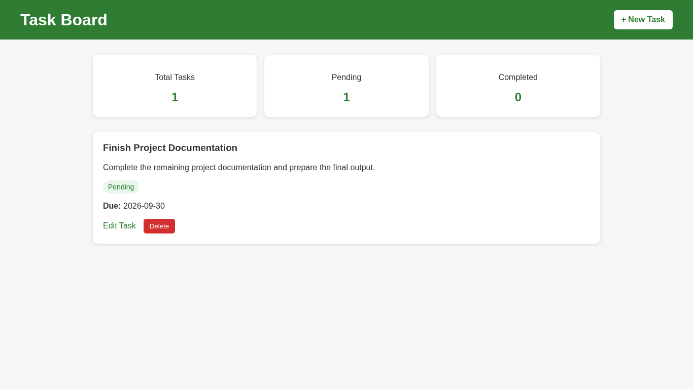
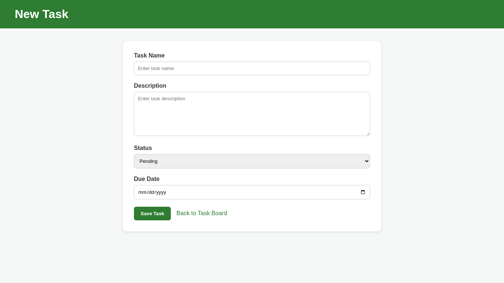
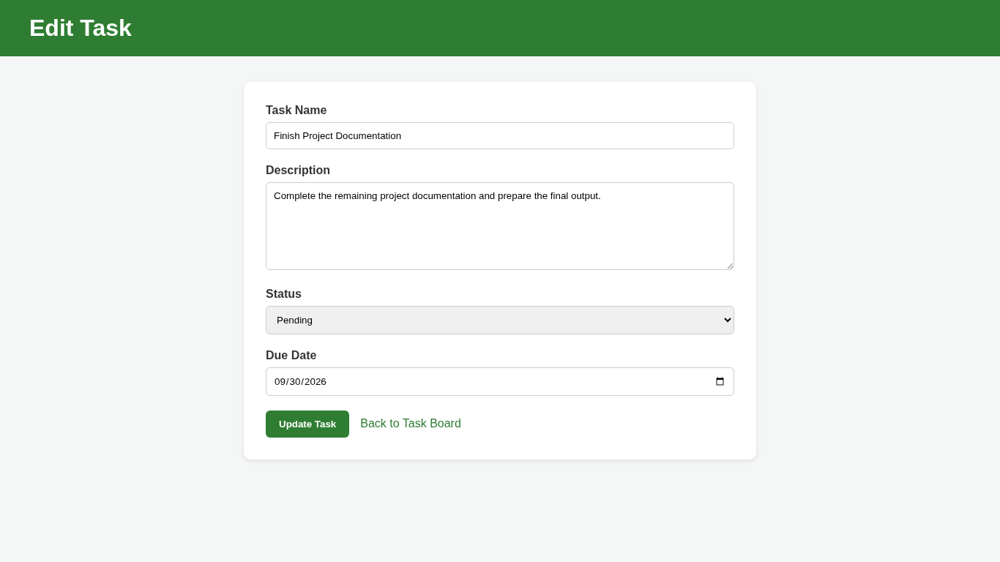
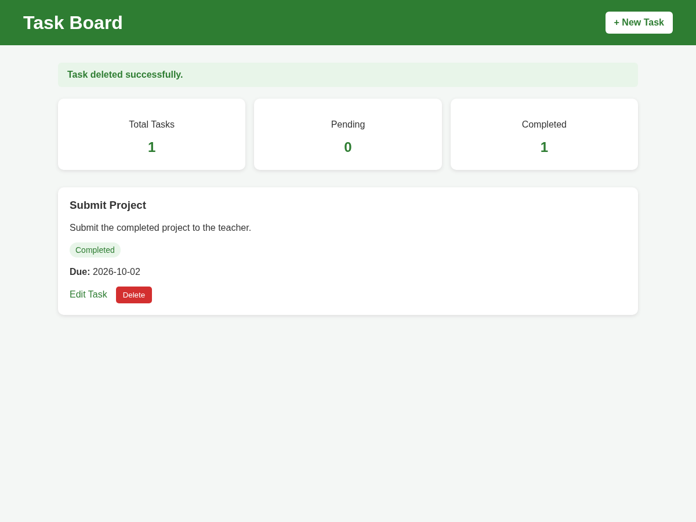

Project Information

Project Code: WST21-PM-2026-SF

Student Name: Pelayo, Jade Robert C.

Course & Year: BSIT - 2nd Year

Database Used: SQLite

Features

- Add Task
- View Tasks
- Edit Task
- Delete Task
- Update Status
- Set Due Date

## System functions

  My Personal Task Manager starts with the Task Manager Homepage, where users can see their existing tasks.
  To create a new task, the user clicks Add Task, enters the task details, and saves it.
   If the user wants to change a task, they can select Edit and update its information.
  If a task is no longer needed, the user can select Delete, and the system removes it from the task list.
   After each action, the system returns to the homepage and displays the updated tasks.

## System Outputs

### Task Manager Homepage

### Add Task

### Edit Task

### Delete Task

